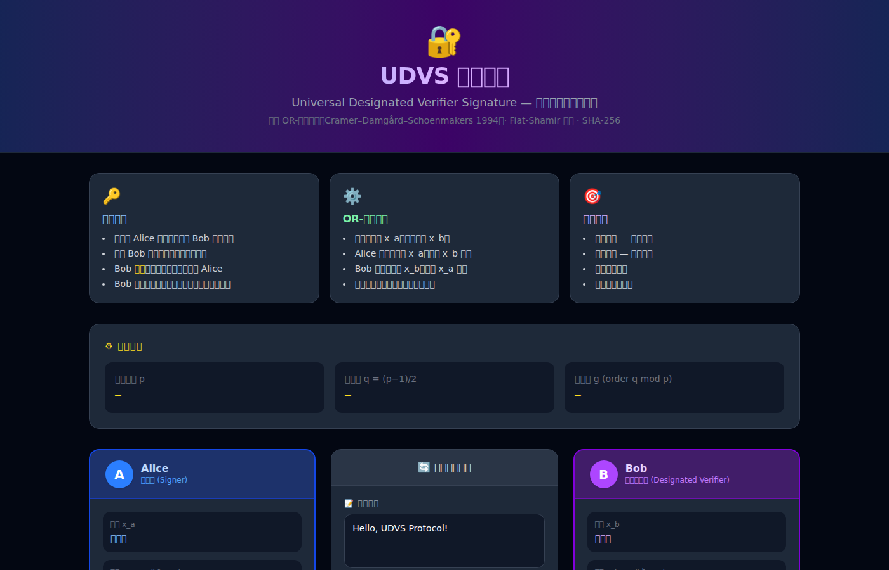
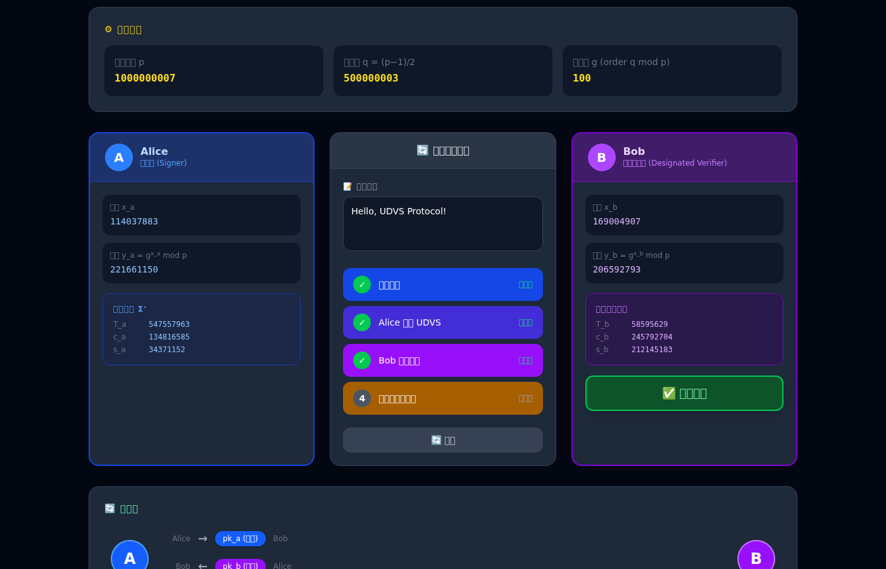

# UDVS 协议演示

**通用指定验证者签名** (Universal Designated Verifier Signature) 的交互式可视化演示，使用 Tailwind CSS 构建。

## 协议简介

UDVS 是一种特殊的数字签名方案，具有以下核心性质：

| 性质 | 说明 |
|------|------|
| **有效性** | Bob 能够验证签名确实有效 |
| **不可转移性** | Bob 无法向第三方证明签名来自 Alice |
| **模拟性** | Bob 可以自己生成计算上不可区分的签名 |

## 技术实现

基于 **OR-证明** 构造（Cramer–Damgård–Schoenmakers, 1994）：

- Alice 证明「我知道 x_a（使得 y_a = g^x_a）**或**我知道 x_b（使得 y_b = g^x_b）」
- Alice 用真实密钥 x_a 处理自己的分支，**模拟** Bob 的分支
- Bob 用真实密钥 x_b 处理自己的分支，**模拟** Alice 的分支
- 两份签名在统计上完全相同，任何第三方无法区分

```
系统参数：p = 1,000,000,007  (安全素数)
          q = 500,000,003  (Sophie-Germain 素数, p = 2q+1)
          g = 100          (q 阶子群生成元)
哈希函数：SHA-256  (Fiat-Shamir 变换)
```

> ⚠️ **注意**：参数仅用于演示，生产环境请使用 ≥ 2048 位的群。

## 文件结构

```
.
├── index.html        # 主页面（Tailwind CSS）
├── js/
│   ├── udvs.js       # UDVS 协议实现（BigInt + Web Crypto API）
│   └── app.js        # UI 交互逻辑
├── css/
│   ├── input.css     # Tailwind 入口 CSS
│   └── tailwind.css  # 编译后的 CSS（已包含在仓库中）
├── docs/             # 截图文档
└── package.json      # npm 配置
```

## 本地运行

```bash
# 安装依赖（仅 Tailwind CLI）
npm install

# 直接用任意 HTTP 服务器打开（需要 ES module 支持）
python3 -m http.server 8080
# 然后访问 http://localhost:8080

# 修改样式后重新编译 CSS
npm run build:css
```

## 演示步骤

1. **密钥生成** — Alice 和 Bob 各自生成密钥对
2. **Alice 生成 UDVS** — Alice 用 OR-证明创建指定验证者签名
3. **Bob 验证签名** — Bob 验证三个条件均成立（✅）
4. **不可转移性演示** — Bob 用自己的密钥模拟一份同样有效的签名，证明不可转移性

## 截图预览

| 初始状态 | 验证通过 |
|----------|----------|
|  |  |

## 参考文献

- Jakobsson, Sako, Impagliazzo (1996). *Designated Verifier Proofs and Their Applications*
- Cramer, Damgård, Schoenmakers (1994). *Proofs of Partial Knowledge and Simplified Design of Witness Hiding Protocols*
- Saeednia et al. (2003). *An Efficient Designated Verifier Signature Scheme*
